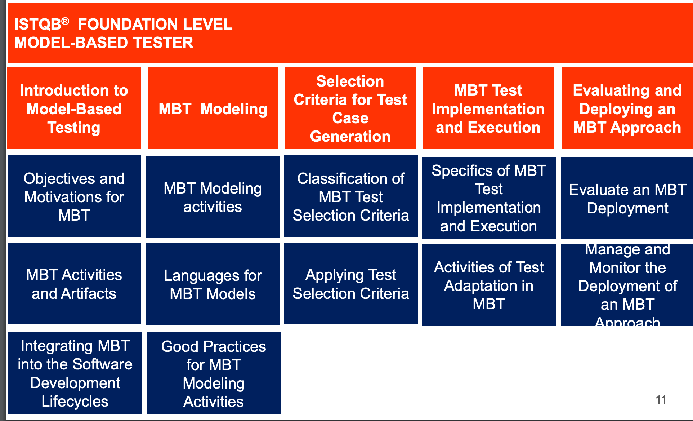

# model based teating

## Project URL
https://www.istqb.org/certification-path-root/model-based-tester.html

## MBT Nutshell
https://www.istqb.org/documents/ISTQB_MBT_Nutshell_2015.pdf

### BO1

ISTQB自身もMBTに関する用語が混在し、その定義も曖昧なまま、実務への適用が遅れていた点を認めている。MBT FLは一般的なテストの用語にモデルベースドテストの用語を統合し、組織に適用しやすくする。

### BO2

ISTQB MBT はMBTを成功させるための前提条件、および、特定の開発プロセスへの適合、そのために必要なことを明らかにする

### BO3

モデルベーステストの確立された技術とベストプラクティスを用いて、MBTモデルを効果的に作成、維持する。

MBTモデル自体の品質を評価するための実践的なアプローチの提供、およびプロセスとしてのモデリングパラダイムの視点の提供。

### BO4

ISTQB MBTでは、どのレベルのどの成果物が有用であるか、またテストプロセスを改善するためにどのように使用できるかについての実践的な基準を提供する

また、最も価値のある情報を選択する方法や、テストプロセスの成果物を自動的に作成するMBTの最先端の機能を活用する方法など、ベストプラクティスを示す

### BO5

組織が品質保証プロセスをより建設的かつ効率的に改善することを支援する。

古典的なテスト設計手法と比較して、モデルベースのテスト設計の高度なシステマティクスは、テストカバレッジとテスト品質のよく知られた理解を保証するだけでなく、テストの必要な品質レベルを定義し、スケーリングするための手段となる。

## Overview

* 1 Introduction to Model-Based Testing – 90 mins.
  * 1.1 Objectives and Motivations for MBT
  * 1.2 MBT Activities and Artifacts in the Fundamental Test Process
  * 1.3 Integrating MBT into the Software Development Lifecycles
* 2 MBT Modeling – 250 mins
  * 2.1 MBT Modeling 
  * 2.2 Languages for MBT Models
  * 2.3 Good Practices for MBT Modeling Activities
* 3 Selection Criteria for Test Case Generation – 205 mins 
  * 3.1 Classification of MBT Test Selection Criteria  
  * 3.2 Applying Test Selection Criteria
* 4 MBT Test Implementation and Execution – 120 mins.
  * 4.1 Specifics of MBT Test Implementation and Execution
  * 4.2 Activities of Test Adaptation in MBT
* 5 Evaluating and Deploying an MBT Approach – 60 mins.
  * 5.1 Evaluate an MBT Deployment
  * 5.2 Manage and Monitor the Deployment of an MBT Approach
 
  
## syllabus

https://www.istqb.org/downloads/send/6-model-based-tester-extension-documents/46-istqb-ctfl-mbt-syllabus.html
